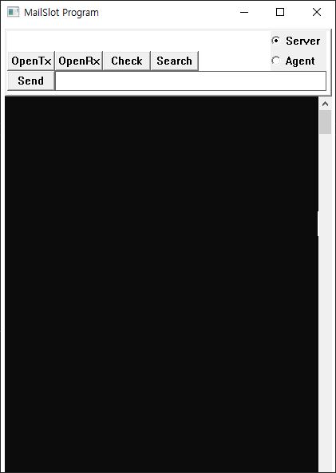

# MailSlot Tester

본 프로젝트는 IPC 기법 중 Mailslot을 구현해보고 테스트 해보기 위해 WinAPI로 만들었습니다. 
모든 로그가 콘솔에 출력이 되는 구조였지만, 오래된 프로젝트라서 그런지 오랜만에 돌려보니 콘솔로 안나오네요. 콘솔 넣는 것도 고생스러웠는데 프로그램도 세월에 녹이 스나봅니다. ㅋㅋ 

제작년도는 17년도이며, 당시 플랫폼 도구 집합은 VS2013(v120) 이였습니다. 
현재 빌드 테스트 해 본 플랫폼 도구 집합은 VS2015(v140), 타겟 플랫폼 버전은 10.0.17134.0 입니다.

  

## Mailslot이란?
프로세스 간 통신(IPC, Inter-Process Communication)으로 다양한 방법이 있겠지만 Mailslot은 그 중 하나입니다. 
개념적으로 이해를 하자면 Mailslot은 이름 그대로 우체통입니다. 
그래서 자신의 주소를 등록해둔 대상에게 메시지를 보낼 수 있습니다. 

## 프로그램의 사용 방법

콘솔에 출력이 안되서 의미가 있겠냐마는 사용 방법은 다음과 같다.

1. 우상단의 라디오버튼 윈도우에서 자신의 역할을 Server로 할 지, Agent로 할 지 결정한다. server-agent라는 이름은 크게 의미는 없다.
2. 예를 들면 Server의 OpenRX 버튼 윈도우를 눌러서 자신의 mailslot path를 등록한다.
3. 메시지를 보내고자 하는 Agent의 OpenTX를 눌러서 Server의 mailslot을 연다.
4. 쓰고 싶은 메시지를 에디트 윈도우에 입력하고 send 버튼 윈도우를 누른다.
5. 보낸 메시지를 확인하기 위해 Server에서 check 버튼 윈도우를 누르면 받은 메시지가 콘솔에 출력된다. 없으면 No Message 라는 메시지 박스가 팝업된다.
6. Search 버튼 윈도우는 대충 코드를 보기에는 현재 등록된 mailslot path 를 모두 출력하는 버튼이다.
