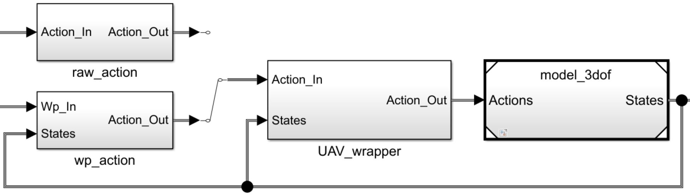

# Python을 이용한 질점 모델과 비행체를 모사하는 Wrapper 모듈 개발 문서

## Contents

- [Python을 이용한 질점 모델과 비행체를 모사하는 Wrapper 모듈 개발 문서](#python을-이용한-질점-모델과-비행체를-모사하는-wrapper-모듈-개발-문서)
  - [Contents](#contents)
  - [0. 전체 구조](#0-전체-구조)
    - [개요](#개요)
  - [1. 질점 모델 (Point-mass Model)](#1-질점-모델-point-mass-model)
    - [특징](#특징)
    - [함수 인터페이스](#함수-인터페이스)
  - [2. Coyote Block-I (UAV)를 모사하는 운동 모델 (Wrapper Model)](#2-coyote-block-i-uav를-모사하는-운동-모델-wrapper-model)
    - [특징](#특징-1)
    - [함수 인터페이스](#함수-인터페이스-1)

## 0. 전체 구조

### 개요

1. 사용자는 원하는 입력(Raw/Waypoint)을 선택 가능하며, 선택된 입력에 따른 제어 명령을 Wrapper 모델에 출력한다. 
2. Wrapper 모델은 운동 모델을 모사하기 위한 모델로 구성되어 있으며, 모사된 상태를 질점 모델에 출력한다. 
3. 질점 모델은 모사된 물체의 선형/회전 속도에 따른 위치, 자세, 속도 등을 연산하고, 물체의 다양한 상태를 출력한다.

## 1. 질점 모델 (Point-mass Model)

### 특징

* 입력으로 동체축 좌표계의 선형 속도 [u, v, w]와 회전 속도 [p, q, r] 으로 구성
* 출력으로 오일러 각으로 표현된 자세각, 동체축 좌표계의 선형/회전 속도 [u, v, w, p, q, r], 지역 좌표계(NED)에서 표현된 물체의 위치 [pN, pE, pD] 등으로 구성 
* 자세 연산에 Euler angle이 아닌 Quaternion을 사용하여 Gimbal Lock 현상을 최대한 방지

### 함수 인터페이스

- void = **point_model**(**attr**:dict)

  | key | value | unit | |
  |---|---|---|---|
  |attr['dt'] | 1.0/15.0 | sec | 연산 주기의 역수, 시간 간격|
  |attr['attitude'] | [phi,theta,psi] | degree | Euler Angle로 표현되는 초기 자세각 |
  |attr['position'] | [pN,pE,pD] | meter | 지역 좌표계(NED)에서 표현된 물체의 초기 위치 |

- void = point_model.**set_action**(**action_in**:list)

  동체축 좌표계의 선형/회전 속도를 입력으로 받는다.  
  action_in = [u, v, w, p, q, r]

- void = point_model.**step**(void)

  시뮬레이션을 1 스텝 진행한다.  

- **state**:list = point_model.**get_state**(void)

  동체축 좌표계의 선형/회전 속도를 출력으로 받는다.  
  state = [u, v, w, p, q, r]

- **all_state**:list = point_model.**get_all_state**(void)

  모든 상태를 출력으로 받는다.  
  state = [pN, pE, pD, roll, pitch, yaw, vN, vE, vD, u, v, w, rollrate, pitchrate, yawrate, p, q, r]

## 2. Coyote Block-I (UAV)를 모사하는 운동 모델 (Wrapper Model)

### 특징

* 질점 모델을 상속받으며, UAV의 운동을 모사하기 위한 Wrapper Model
* 고정익 비행체의 운동을 1차 지연 함수로 모사

### 함수 인터페이스
- void = uav_model_wrapper.**set_raw_action**(**action_in**:list)

  동체축 좌표계의 선형/회전 속도를 입력으로 받는다.  
  입력 받은 값을 운동 모델에 적용한다.  
  action_in = [u, v, w, p, q, r]

- void = uav_model_wrapper.**set_wp_action**(**wp_in**:list)

  선회를 위한 명령을 입력 받아, 선회를 위한 명령을 생성하여 운동 모델에 적용한다. 
  비행 속력 명령을 추종하면서 선회점 주변을 특정 반경을 유지하면서 선회한다.  

  wp_in = [TpN, TpE, TpD, Spd, Rd, Dir]
  - TpN : 선회점의 pN 위치
  - TpE : 선회점의 pE 위치
  - TpD : 선회점의 pD 위치
  - Spd : 비행 속력 명령
  - Rd  : 선회 반경
  - Dir : 선회 방향 (+1:CW, -1:CCW)

- void = uav_model_wrapper.**step**(void)

  운동 모델의 동특성을 여기서 모사하며, 시뮬레이션을 1 스텝 진행한다.  
